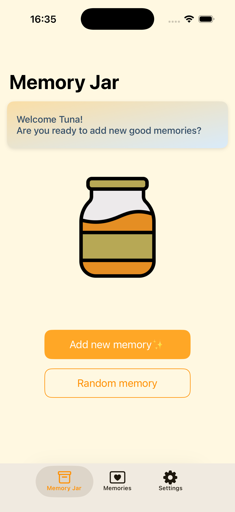
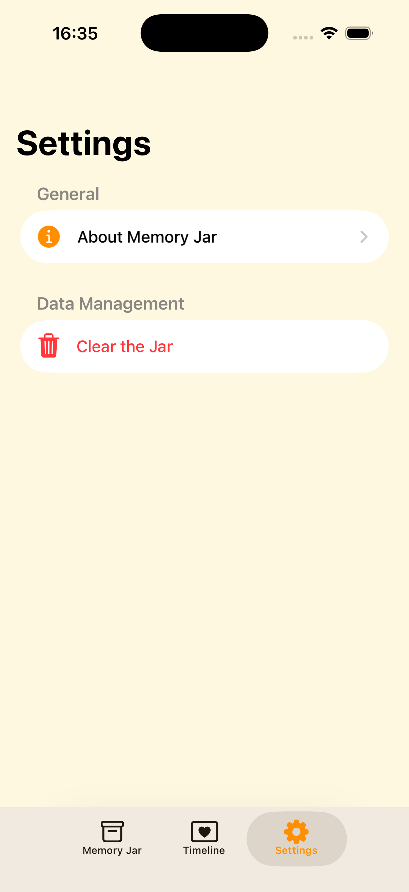
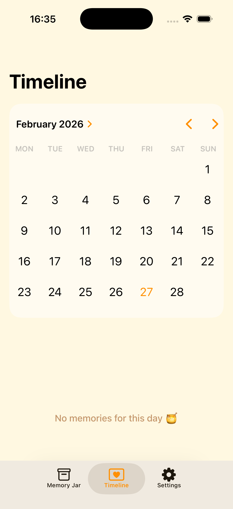

# 🍯 Memory Jar

  
  
  

**Memory Jar** is a minimalist, premium iOS application designed to help users capture and cherish life's most precious moments with a mindful approach. Built with a focus on high-quality code standards and a warm, inviting aesthetic.

## 🚀 Key Features

- **🧠 Advanced MVVM Architecture**: Pure separation of concerns using the Model-View-ViewModel pattern for scalability and testability.
- **📅 Interactive Timeline**: Explore your journey through a native `UICalendarView` integration, filtering memories with precision.
- **✨ Premium UI/UX**: Soft honey-themed palette, glassmorphism effects, and SnapKit-powered responsive layouts.
- **🎲 Random Recall**: Shake off nostalgia by pulling a random memory from your jar with one tap.
- **🔒 Local & Private**: 100% offline experience using Core Data for secure persistence on your device.

## 🛠 Tech Stack & Tools

| Category | Technology |
| :--- | :--- |
| **Language** | Swift 5.9+ |
| **Architecture** | MVVM |
| **UI Framework** | UIKit (Programmatic UI) |
| **Layout** | SnapKit (Auto Layout) |
| **Persistence** | Core Data |
| **Components** | UICalendarView, UIContextualMenu, Diffable Data Sources |
| **Design** | Honey Palette, Glassmorphism, SF Symbols 5 |

## 📖 Architecture Deep Dive

The project demonstrates a production-ready application structure:

- **ViewModels**: Business logic and state management are isolated, communicating with Views via callbacks.
- **Managers**: Centralized `CoreDataManager` acting as a robust service layer.
- **Programmatic UI**: No Storyboards or XIBs. Every pixel is defined in code for maximum flexibility and version control clarity.

---

## 📫 Connect with Me

  
  

Developed with ❤️ by **[Tuna Arıkaya](https://github.com/tunaarikaya)**
